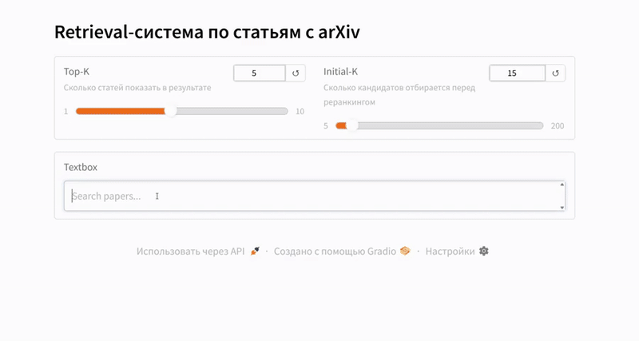

# Retrieval-система по статьям с arXiv

Практический проект Яндекс Практикума по разработке системы семантического поиска научных статей.

## Демонстрация



## Описание

Интеллектуальная система поиска релевантных научных статей из базы arXiv на основе семантического анализа запросов. Система использует двухэтапный подход: быстрый векторный поиск с последующим реранкингом для повышения точности результатов.

## Технологический стек

- **Embeddings**: sentence-transformers/all-MiniLM-L6-v2
- **Reranker**: cross-encoder/ms-marco-MiniLM-L-6-v2
- **Vector Search**: FAISS (IndexFlatIP)
- **Backend**: FastAPI
- **Frontend**: Gradio
- **ML Framework**: PyTorch, Transformers
- **Data Processing**: Pandas, NumPy

## Метрики качества

- **MRR@5**: 0.92
- **Среднее время запроса**: ~36 мс
  - Кодирование запроса: ~5 мс
  - Поиск в индексе: ~1 мс
  - Реранкинг: ~30 мс

## Структура проекта

```
.
├── demo/                     # Демонстрационное приложение
│   ├── gradio_app.py         # Gradio интерфейс
│   ├── server.py             # FastAPI сервер
│   ├── retrieval_system.py   # Класс системы поиска
│   └── README.md             # Инструкция по запуску
├── nlp_s3_project/           # Данные
│   ├── arxiv-metadata-s.json # Метаданные статей (98,213 статей)
│   └── test_sample.csv       # Тестовая выборка
├── solution.ipynb            # Jupyter notebook с полным анализом
├── requirements.txt          # Зависимости проекта
└── README.md                 # Этот файл
```

## Установка

```bash
pip install -r requirements.txt
```

## Использование

См. инструкции в `demo/README.md`

## Этапы разработки

1. **EDA** - Исследовательский анализ данных
2. **Реализация системы** - Разработка retrieval-системы с двухэтапным поиском
3. **Оценка качества** - Тестирование на test_sample.csv
4. **Оптимизация** - Анализ зависимости качества от параметров
5. **Демонстрация** - Веб-интерфейс для взаимодействия с системой

## Архитектура решения

### Индексация

- Конкатенация title + abstract для каждой статьи
- Генерация эмбеддингов через sentence-transformers
- Нормализация векторов для косинусного сходства
- Построение FAISS индекса (Flat IP)

### Поиск

1. Кодирование запроса в вектор
2. Поиск top-K кандидатов через FAISS
3. Реранкинг кандидатов с помощью cross-encoder
4. Возврат top-N результатов